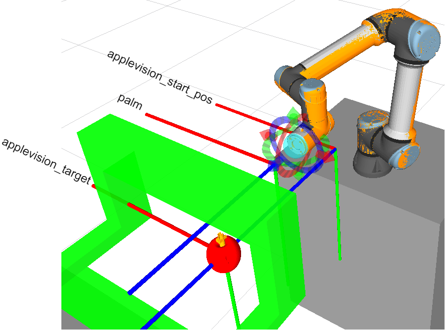
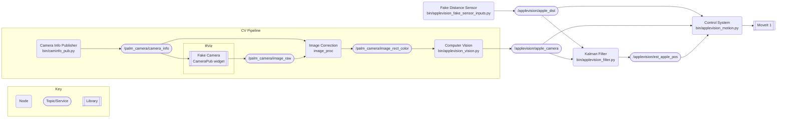
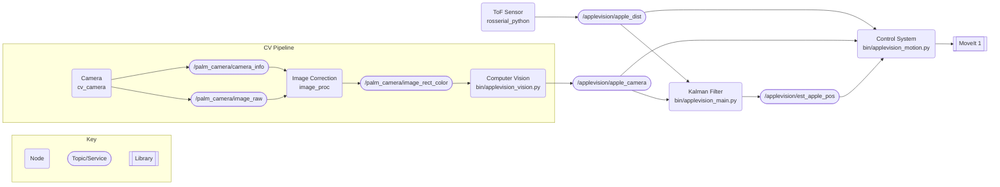
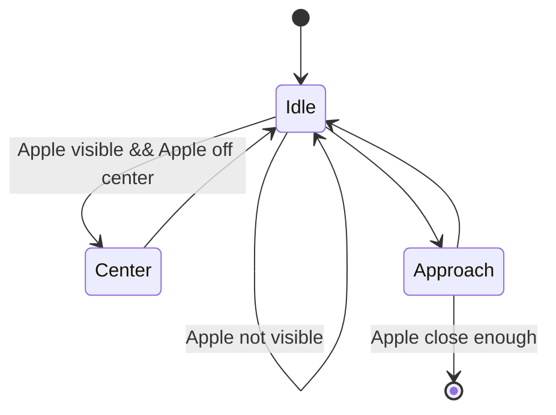

# Applevision


Applevision is a 2022 ECE Capstone team consisting of @cogswatch, @PeterJBloch, and @prototypicalpro. The project abstract is as follows:
> In 21st century, there is an increasing demand for labor in the agricultural sector. To address this, many are turning to robotics. Existing agricultural robots involve either expensive computational planning or do not support real-time adjustments to the picking environment. Apple Vision designed a low-cost system that can target and guide the palm of a custom apple grasper to within grabbing distance of an apple. Data is processed in real time and sent to the control system, which attempts to move towards the nearest apple. Changes in the environment lead to retrying the approach.

## Setup

You can install this package and it's dependencies as follows:

1. Install ROS Melodic (Ubuntu 18.04) on to your computer:
    1. Follow the [ROS installation instructions](http://wiki.ros.org/melodic/Installation/Ubuntu). Use `ros-melodic-desktop-full`.
    2. Install Python 3 with ROS support (translated from [this tutorial](https://medium.com/@beta_b0t/how-to-setup-ros-with-python-3-44a69ca36674)):
        ```sh
        sudo apt install python3-pip python3-dev python-catkin-tools
        pip3 install --upgrade pip
        pip3 install rospkg catkin_pkg
        ```
2. Create a workspace linking against python3 and start using it: 
   ```sh
    mkdir ~/catkin_ws
    cd ~/catkin_ws
    mkdir src
    catkin init
    catkin config -DPYTHON_EXECUTABLE=/usr/bin/python3 -DPYTHON_INCLUDE_DIR=/usr/include/python3.6m -DPYTHON_LIBRARY=/usr/lib/x86_64-linux-gnu/libpython3.6m.so
    catkin build # if this fails, make sure you setup the environment correctly
    source devel/setup.bash
    ```

3. Use [vcstool](http://wiki.ros.org/vcstool) to clone all of the repositories needed into your workspace:
    ```sh
    sudo apt install python3-vcstool
    vcs import --input https://raw.githubusercontent.com/OSUrobotics/applevision_rospkg/master/applevision_ws.repos src
    ```
    After this your workspace should look similar to the following:
    ```
    catkin_ws/
    ├─ build/
    ├─ devel/
    ├─ src/
    │  ├─ applevision_moveit_config/
    │  ├─ applevision_rospkg/
    │  ├─ fmauch_universal_robot/
    │  ├─ rviz_camera_stream/
    │  ├─ rviz_lighting/
    │  ├─ Universal_Robots_ROS_Driver/
    │  ├─ vision_opencv/
    │  ├─ CMakeLists.txt
    ├─ ...
    ```

4. Use [rosdep](http://wiki.ros.org/rosdep) to install global dependencies automatically. You only need to run this step once per computer.
    ```sh
    rosdep update
    rosdep install -y --from-paths src --ignore-src --rosdistro ${ROS_DISTRO}
    ```

5. Install some missing python dependencies manually:
    ```sh
    pip3 install empy opencv-python-headless
    pip3 install --upgrade numpy
    ```

6. Finally, build the workspace and source the new setup file. You are now ready to start development.
    ```sh
    catkin build
    source devel/setup.bash
    ```

## Launching

Launching any program in your workspace first requires that the workspace `devel/setup.bash` file has run in the current terminal. Since this step can be easy to forget and results in unpredictable and catestrophic failure, it is recommended that it be added to the `~/.bashrc` file:

```sh
# at the end of ~/.bashrc
source ~/catkin_ws/devel/setup.bash
```

Should any errors occur when running the below commands, a good troubleshooting step is to re-run `source devel/setup.bash` and try the command again: more often than not this fixes the issue.

### Simulated Robot

```sh
# Each of these commands are in seperate terminals

# Launch simulated robot, MoveIt, and RViz
# You'll also need to enable the "CameraPub" widget in the RViz window for the camera to work
roslaunch applevision_moveit_config demo.launch
# Launch simulated camera and distance sensor
roslaunch applevision_rospkg fake_sensor.launch
# Run the control system
src/applevision_rospkg/bin/applevision_motion.py
```

### Real Robot

The UR5e must be powered on and running the `avl_pc` program for the below launch sequence to work. Additionally, the Apple Vision camera should be connected and the [distance sensor bridge](https://github.com/OSUrobotics/applevision_distance_bridge) should be setup and connection.

```sh
# Each of these commands are in seperate terminals

# Base UR5e driver. IP is for the UR5e in millrace.
roslaunch ur_robot_driver ur5e_bringup.launch robot_ip:=169.254.177.232
# Robot controller and MoveIt.
roslaunch applevision_moveit_config ur5e_moveit_planning_execution.launch
# RViz
roslaunch applevision_moveit_config moveit_rviz.launch
# Real camera and distance sensor
roslaunch applevision_rospkg real_sensor_robot.launch
# Control system (make sure everything else looks good first)
src/applevision_rospkg/bin/applevision_motion.py
```

## Development

### Repository Structure

In general this repository follows the [ROS package guidelines](http://wiki.ros.org/Packages). A quick overview of the file structure is shown below:

```
catkin_ws/
├─ bin/
|  ├─ applevision_fake_sensor_inputs.py     Fake distance sensor for simulated environment
|  ├─ applevision_filter.py                 Kalman filter
|  ├─ applevision_motion.py                 Control system
|  ├─ applevision_vision.py                 Computer vision
|  ├─ applevision_visualizer.py             Debug RViz marker generation
|  ├─ camerainfo_pub.py                     Camera info publisher utility
|  ├─ tf2_proxy_run.py                      TF2 Proxy for Python 3 utility
├─ config/
|  ├─ camerainfo.yaml                       OpenCV camera calibration for the Apple Vision camera
├─ launch/
|  ├─ config.launch                         Base launch file for apple vision
|  ├─ fake_sensor.launch                    Launch file for simulated environment
|  ├─ real_sensor_robot.launch              Launch file for the real UR5e
├─ models/
|  ├─ applevision_end_effector.SLDPRT       CAD model for the adapter used to mount the sensors to the UR5e.
├─ src/
│  ├─ applevision_kalman/                   Kalman filter and distance sensor model
|  ├─ applevision_vision/                   Model weights for computer vision
|  ├─ helpers/                              Misc. helpers used in multiple scripts
├─ ...
```

### TF Frames



Apple Vision relies on the following [TF frames](http://wiki.ros.org/tf2) to be defined:
* `palm` - The current position of the end effector, as shown in the image above. The XY axis must be aligned to the camera coordinate system (top left), and the Z axis must be pointed towards the apple. Defined in [`applevision_moveit_config`](https://github.com/OSUrobotics/applevision_moveit_config/blob/db5c61051ab9451ddaa7eff7fa74c83ff5d4e650/urdf/ur5e.xacro#L67-L73).
* `palm_dist` - A fixed offset from the `palm` frame modelling the exact position of the distance sensor, and rotated such that the X axis points towards the apple (for compatibility with the `Range` message). Defined in [`config.launch`](./launch/config.launch).
* `palm_camera` - A fixed offset from the `palm` frame modelling the exact position of the camera. Defined in [`config.launch`](./launch/config.launch).
* `applevision_target` - A point defining where the fake apple is located in the simulated environment. Defined in [`config.launch`](./launch/config.launch).
* `applevision_start_pos` - An arbitrary point used as the "zero" for the Kalman Filter. Must be fixed to the world. Defined in [`config.launch`](./launch/config.launch).

### General Architecture

In addition to being able to control the UR5e, Apple Vision features a full-simulated environment for local development. The below diagrams show the data flow for these two environments: See [ROS Concepts](http://wiki.ros.org/ROS/Concepts) for more information on how ROS projects are architected.

#### Simulated Robot

The simulated environment uses [RViz Camera Stream](https://github.com/OSUrobotics/rviz_camera_stream) and our homemade [ToF model](src/applevision_kalman/model.py) to generate simulated sensor data. 



#### Real Robot



#### Using TF in Python 3

As ROS melodic does not formally support Python 3, attempting to use TF in a Python 3 environment will result in an error similar to the following:
```python
import tf2_ros
```
```console
Traceback (most recent call last):
...
ImportError: dynamic module does not define module export function (PyInit__tf2)
```

To get around this limitation, Apple Vision provides a [utility](bin/tf2_proxy_run.py) that exposes `tf_buffer.lookup_transform` and `tf_buffer.transform` as a service. All Python 3 files in Apple Vision use this service:
```python
tf_transform = rospy.ServiceProxy('Tf2Transform', Tf2Transform)
result = tf_transform(...)
```

For places where these services need to be invoked frequently (>10Hz), Apple Vision uses a [`RobustServiceProxy`](src/helpers/__init__.py) helper with automatic retry and linear backoff to minimize network-related errors.

### Control System Overview

A rough state diagram of the control system is shown below:



Where (axis are relative to the `palm` frame):
* `Idle` - Robot isn't moving.
* `Center` - Robot is correcting XY position relative to the apple.
* `Approach` - Robot is moving towards the apple (ideally only in the Z axis).

The [complete implementation](bin/applevision_motion.py) also contains several transitions not shown that either handle errors (ex. MoveIt is unable to plan a path) or stop the robot early if an obstruction is detected.

### Project Hosting

Physically, the Apple Vision project is split into five GitHub repositories under the [OSURobotics organization](https://github.com/OSUrobotics). Four which are required for operation of the system:
 * [`applevision_rospkg`](https://github.com/OSUrobotics/applevision_rospkg) - This repository, all code and project documentation.
 * [`applevision_moveit_config`](https://github.com/OSUrobotics/applevision_moveit_config) - Configuration files for the UR5e in the Millrace lab ([URDF](http://wiki.ros.org/urdf), [SRDF](http://wiki.ros.org/srdf), joint limits, etc.).
 * [`applevision_distance_bridge`](https://github.com/OSUrobotics/applevision_distance_bridge) - Firmware for an [OpenCM9.04 board](https://emanual.robotis.com/docs/en/parts/controller/opencm904/) to serve as a bridge between ROS and a VL53L0X ToF sensor.
 * [`rviz_camera_stream`](https://github.com/OSUrobotics/rviz_camera_stream) - A fork of [lucasw/rviz_camera_stream](https://github.com/lucasw/rviz_camera_stream) with a small patch to fix a bug.

And one that stores a testbench used during initial research:
 * [`applevision_tof_profiler`](https://github.com/OSUrobotics/applevision_tof_profiler) - All code used to profile the VL53L0X ToF sensor.
