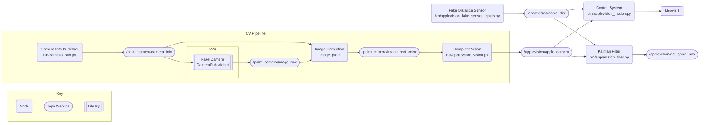
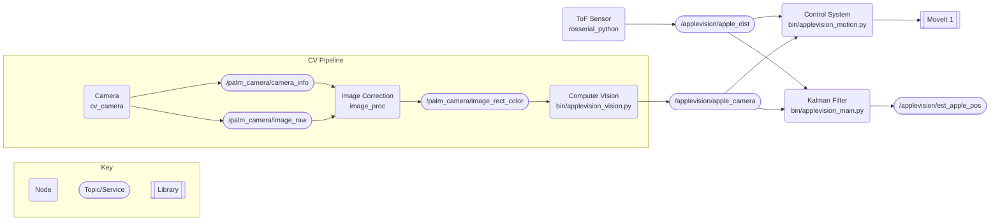

# Applevision


Applevision is a 2022 ECE Capstone team consisting of @cogswatch, @PeterJBloch, and @prototypicalpro. The project abstract is as follows:
> In 21st century, there is an increasing demand for labor in the agricultural sector. To address this, many are turning to robotics. Existing agricultural robots involve either expensive computational planning or do not support real-time adjustments to the picking environment. Apple Vision designed a low-cost system that can target and guide the palm of a custom apple grasper to within grabbing distance of an apple. Data is processed in real time and sent to the control system, which attempts to move towards the nearest apple. Changes in the environment lead to retrying the approach.

## Setup

You can install this package and it's dependencies as follows:

1. Install ROS melodic with Python 3 support on your machine: https://www.dhanoopbhaskar.com/blog/2020-05-07-working-with-python-3-in-ros-kinetic-or-melodic/. TODO: test.

2. Create a workspace linking against python3 and start using it: 
   ```sh
    mkdir ~/catkin_ws
    cd ~/catkin_ws
    catkin init
    catkin config -DPYTHON_EXECUTABLE=/usr/bin/python3 -DPYTHON_INCLUDE_DIR=/usr/include/python3.6m -DPYTHON_LIBRARY=/usr/lib/x86_64-linux-gnu/libpython3.6m.so
    catkin build # if this fails, make sure you setup the environment correctly
    source devel/setup.bash
    ```

3. Use [vcstool](http://wiki.ros.org/vcstool) to clone all of the repositories needed into your workspace:
    ```sh
    sudo apt install python3-vcstool
    vcs import --input https://raw.githubusercontent.com/OSUrobotics/applevision_rospkg/master/applevision_ws.repos src
    ```
    After this your workspace should look similar to the following:
    ```
    catkin_ws/
    ├─ build/
    ├─ devel/
    ├─ src/
    │  ├─ applevision_moveit_config/
    │  ├─ applevision_rospkg/
    │  ├─ fmauch_universal_robot/
    │  ├─ rviz_camera_stream/
    │  ├─ rviz_lighting/
    │  ├─ Universal_Robots_ROS_Driver/
    │  ├─ vision_opencv/
    │  ├─ CMakeLists.txt
    ├─ ...
    ```

4. Use [rosdep](http://wiki.ros.org/rosdep) to install global dependencies automatically. You only need to run this step once per computer.
    ```sh
    rosdep update
    rosdep install -y --from-paths src --ignore-src --rosdistro ${ROS_DISTRO}
    ```

5. Install some missing python dependencies manually:
    ```sh
    pip3 install --upgrade pip
    pip3 install empy numpy opencv-python-headless
    ```

6. Finally, build the workspace and source the new setup file. You are now ready to start development.
    ```sh
    catkin build
    source devel/setup.bash
    ```

## Launching

Launching any program in your workspace first requires that the workspace `devel/setup.bash` file has run in the current terminal. Since this step can be easy to forget and results in unpredictable and catestrophic failure, it is recommended that it be added to the `~/.bashrc` file:

```sh
# at the end of ~/.bashrc
source ~/catkin_ws/devel/setup.bash
```

Should any errors occur when running the below commands, a good troubleshooting step is to re-run `source devel/setup.bash` and try the command again: more often than not this fixes the issue.

### Simulated Robot

```sh
# Each of these commands are in seperate terminals

# Launch simulated robot, MoveIt, and RViz
# You'll also need to enable the "CameraPub" widget in the RViz window for the camera to work
roslaunch applevision_moveit_config demo.launch
# Launch simulated camera and distance sensor
roslaunch applevision_rospkg fake_sensor.launch
# Run the control system
src/applevision_rospkg/bin/applevision_motion.py
```

### Real Robot

The UR5e must be powered on and running the `avl_pc` program for the below launch sequence to work. TODO connecting sensors and flashing OpenCM 9.04 board.

```sh
# Each of these commands are in seperate terminals

# Base UR5e driver. IP is for the UR5e in millrace.
roslaunch ur_robot_driver ur5e_bringup.launch robot_ip:=169.254.177.232
# Robot controller and MoveIt.
roslaunch applevision_moveit_config ur5e_moveit_planning_execution.launch
# RViz
roslaunch applevision_moveit_config moveit_rviz.launch
# Real camera and distance sensor
roslaunch applevision_rospkg real_sensor_robot.launch
# Control system (make sure everything else looks good first)
src/applevision_rospkg/bin/applevision_motion.py
```

## Development

### Workspace Structure

TODO

### General Architecture

The general architecture for Applevision is shown in the diagram below.

NOTE: omitting Tf2Proxy.

NOTE: kalman filter is dead code currently

Development:


Production:



TODO: block comments at the top of every file

### Project Structure

Physically, the Apple Vision project is split into five GitHub repositories under the [OSURobotics organization](https://github.com/OSUrobotics). Four which are required for operation of the system:
 * [`applevision_rospkg`](https://github.com/OSUrobotics/applevision_rospkg) - This repository, all code and project documentation.
 * [`applevision_moveit_config`](https://github.com/OSUrobotics/applevision_moveit_config) - Configuration files for the UR5e in the Millrace lab ([URDF](http://wiki.ros.org/urdf), [SRDF](http://wiki.ros.org/srdf), joint limits, etc.).
 * [`applevision_distance_bridge`](https://github.com/OSUrobotics/applevision_distance_bridge) - Firmware for an [OpenCM9.04 board](https://emanual.robotis.com/docs/en/parts/controller/opencm904/) to serve as a bridge between ROS and a VL53L0X ToF sensor.
 * [`rviz_camera_stream`](https://github.com/OSUrobotics/rviz_camera_stream) - A fork of [lucasw/rviz_camera_stream](https://github.com/lucasw/rviz_camera_stream) with a small patch to fix a bug.

And one that stores a testbench used during initial research:
 * [`applevision_tof_profiler`](https://github.com/OSUrobotics/applevision_tof_profiler) - All code used to profile the VL53L0X ToF sensor.